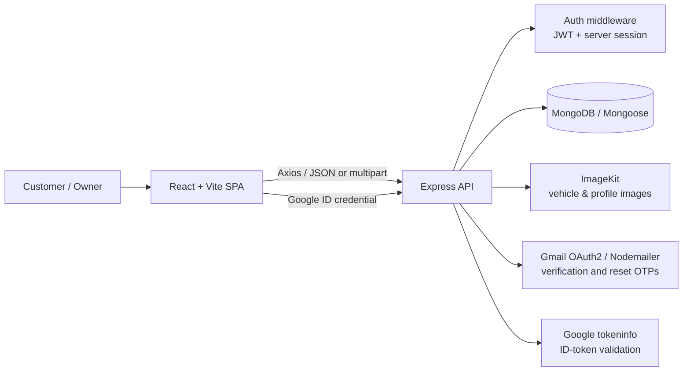
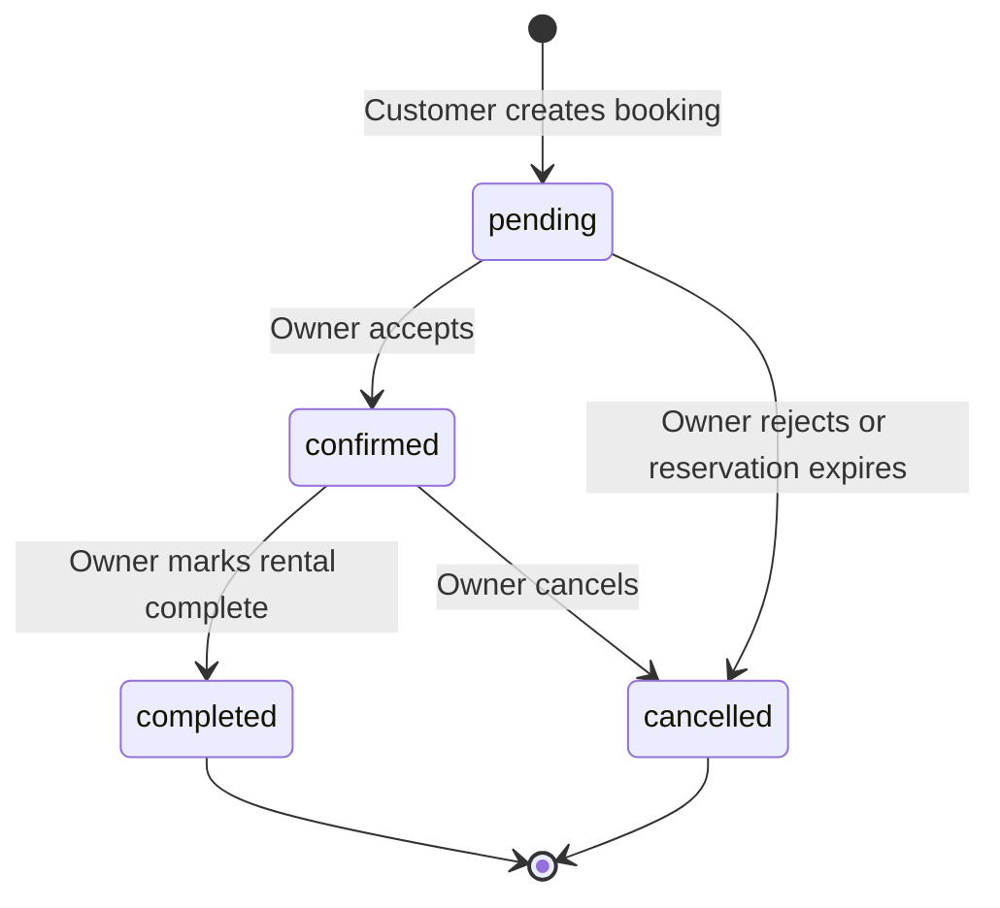

# Stat

Stat is a full-stack car-rental marketplace. Customers can discover vehicles, check date-specific availability, make reservations, share a pickup location for confirmed rentals, and review completed rentals. Registered users can become owners and manage listings, bookings, and dashboard metrics.

The project is a JavaScript MERN application: a React single-page application (SPA) and an Express API backed by MongoDB.

**Live demo:** [statclient-gray.vercel.app](https://statclient-gray.vercel.app/)

## Contents

- [Features](#features)
- [Architecture](#architecture)
- [Technology](#technology)
- [Project structure](#project-structure)
- [Getting started](#getting-started)
- [Configuration](#configuration)
- [Application flows](#application-flows)
- [API reference](#api-reference)
- [Data model](#data-model)
- [Scripts](#scripts)
- [Deployment](#deployment)
- [Security notes](#security-notes)

## Features

### Customer experience

- Browse currently listed cars and view vehicle details.
- Search available cars by location and rental date range.
- Register with email verification OTP, sign in with email/password, or authenticate with Google.
- Recover a password with a time-limited email OTP.
- Create bookings, see booking history, and share a browser-provided pickup location after a booking is confirmed.
- Review completed bookings once; each review updates the car's stored average rating and review count.
- Use the interface in English or Hindi, with light/dark theme support.

### Owner experience

- Upgrade an authenticated customer account to an owner account.
- Add cars with ImageKit image uploads, contact number, features, rental price, and location.
- Toggle a listing's availability or retire it without deleting booking history.
- Review incoming bookings and move them through the allowed lifecycle.
- View dashboard totals for cars, bookings, pending/completed rentals, revenue, and recent bookings.

## Architecture



The browser app renders pages, holds UI state, and attaches the JWT as an `Authorization: Bearer <token>` header. The API owns authorization, business rules, database access, email delivery, and media uploads.

### Frontend design

`AppProvider` is the shared application state layer. It restores the saved session, loads public cars, configures Axios, and exposes authentication, date, and car state. `ThemeProvider` supplies theme state. React Router defines public routes plus the protected `/my-bookings` and `/owner/*` areas. The owner area uses nested routes inside its own layout.

### Backend design

Routes are thin HTTP definitions; controllers contain feature logic; Mongoose models define persistence. The `protect` middleware validates both the signed JWT and its backing `Session` document, so logout or a password reset can revoke otherwise valid tokens. `requireOwner` protects owner-only operations.

### Booking lifecycle



Pending reservations expire after `PENDING_BOOKING_EXPIRY_HOURS` (24 by default). Date-overlapping non-cancelled bookings prevent a car from being booked. A completed booking is required before its customer may submit a review.

## Technology

| Area | Tools |
| --- | --- |
| Client | React 19, Vite, React Router, Tailwind CSS, Axios, Framer Motion |
| Server | Node.js, Express 5 |
| Database | MongoDB Atlas or MongoDB, Mongoose |
| Authentication | JWT, server-side session records, bcrypt, Google ID tokens |
| Communications | Nodemailer with Gmail OAuth2 |
| Media | Multer and ImageKit |
| Internationalization | i18next and react-i18next (English/Hindi) |
| Hosting configuration | Vercel |

## Project structure

```text
Stat/
├── client/                         # React/Vite SPA
│   ├── src/
│   │   ├── assets/                 # Brand assets, vehicle images, and icons
│   │   ├── components/             # Reusable customer-facing UI
│   │   │   ├── owner/              # Owner navbar, sidebar, and titles
│   │   │   ├── Banner.jsx
│   │   │   ├── Footer.jsx
│   │   │   ├── Hero.jsx
│   │   │   ├── Login.jsx           # Email, OTP, password-reset, Google flows
│   │   │   ├── Navbar.jsx
│   │   │   ├── ProtectedRoute.jsx  # Customer/owner route access guard
│   │   │   └── carCard.jsx
│   │   ├── Context/
│   │   │   ├── AppContext.jsx      # API, authentication, cars, booking dates
│   │   │   └── ThemeContext.jsx    # Theme preference state
│   │   ├── locales/
│   │   │   ├── en/common.json      # English translation strings
│   │   │   └── hi/common.json      # Hindi translation strings
│   │   ├── pages/
│   │   │   ├── owner/
│   │   │   │   ├── AddCar.jsx
│   │   │   │   ├── Dashboard.jsx
│   │   │   │   ├── Layout.jsx
│   │   │   │   ├── ManageBookings.jsx
│   │   │   │   └── ManageCars.jsx
│   │   │   ├── CarDetails.jsx
│   │   │   ├── Cars.jsx
│   │   │   ├── Home.jsx
│   │   │   └── MyBookings.jsx
│   │   ├── App.jsx                 # Route definitions and page shell
│   │   ├── i18n.js                 # i18next initialization
│   │   ├── index.css               # Global Tailwind styles
│   │   └── main.jsx                # React entry point and providers
│   ├── public/                     # Static public assets
│   ├── package.json
│   ├── vite.config.js
│   └── vercel.json                 # SPA rewrite configuration
├── server/                         # Express API
│   ├── configs/
│   │   ├── config.js               # Required server environment validation
│   │   ├── db.js                   # MongoDB connection
│   │   └── imagekit.js             # ImageKit client
│   ├── Controllers/
│   │   ├── bookingController.js    # Availability, reservations, pickup location
│   │   ├── ownerController.js      # Vehicle management and dashboard
│   │   ├── reviewController.js     # Review creation and rating summaries
│   │   └── userController.js       # Local/Google auth, OTPs, sessions
│   ├── middleware/
│   │   ├── auth.js                 # JWT/session and owner authorization
│   │   └── multer.js               # Multipart upload handling
│   ├── models/
│   │   ├── BookingModel.js
│   │   ├── CarModel.js
│   │   ├── ReviewModel.js
│   │   ├── SessionModel.js
│   │   └── UserModel.js
│   ├── routes/
│   │   ├── bookingRoutes.js
│   │   ├── ownerRoutes.js
│   │   ├── reviewRoutes.js
│   │   └── userRoutes.js
│   ├── package.json
│   ├── server.js                   # API bootstrap and route mounting
│   └── vercel.json                 # Server deployment configuration
├── .gitignore
└── README.md
```

## Getting started

### Prerequisites

- Node.js 20 or later
- A MongoDB database (Atlas or local)
- An ImageKit account for uploads
- A Google Cloud OAuth client and Gmail OAuth2 refresh token for email OTP delivery
- A Google OAuth web client for client-side Google Sign-In

### 1. Clone and install dependencies

```bash
git clone <your-repository-url>
cd Stat

cd server
npm install

cd ../client
npm install
```

### 2. Configure environment variables

Create `server/.env` and `client/.env` using the templates in the next section. Do not commit either file.

### 3. Start the API

```bash
cd server
npm run server
```

The API listens on `http://localhost:3000` unless `PORT` is set.

### 4. Start the client

In a second terminal:

```bash
cd client
npm run dev
```

Vite will display the local client URL (normally `http://localhost:5173`). Set `VITE_BASE_URL` to the API URL, for example `http://localhost:3000`.

## Configuration

### Server: `server/.env`

```dotenv
# Required
MONGO_URI=mongodb+srv://<user>:<password>@<cluster>/<database>
JWT_SECRET=replace-with-a-long-random-secret

# Gmail OAuth2 credentials used by Nodemailer to send OTP messages
GOOGLE_CLIENT_ID=<google-oauth-client-id>
GOOGLE_CLIENT_SECRET=<google-oauth-client-secret>
GOOGLE_REFRESH_TOKEN=<gmail-oauth-refresh-token>
GOOGLE_USER=your-sending-address@example.com

# ImageKit credentials
IMAGEKIT_PUBLIC_KEY=<imagekit-public-key>
IMAGEKIT_PRIVATE_KEY=<imagekit-private-key>
IMAGEKIT_URL_ENDPOINT=https://ik.imagekit.io/<your-imagekit-id>

# Optional
PORT=3000
BUSINESS_TIME_ZONE=Asia/Kolkata
PENDING_BOOKING_EXPIRY_HOURS=24
```

`GOOGLE_CLIENT_ID` also validates the audience of Google ID tokens submitted through `/api/user/google-auth`. The email configuration checks for the Gmail values at application startup.

### Client: `client/.env`

```dotenv
VITE_BASE_URL=http://localhost:3000
VITE_CURRENCY=₹
VITE_GOOGLE_CLIENT_ID=<google-oauth-web-client-id>
```

Vite exposes only values prefixed with `VITE_` to browser code. Never place database credentials, JWT secrets, ImageKit private keys, or Gmail credentials in the client environment file.

## Application flows

### Authentication and sessions

1. Local registration creates an unverified user and sends a six-digit OTP that expires after 10 minutes.
2. OTP verification, local login, or Google sign-in creates a `Session` record and signs a seven-day JWT containing the user and session IDs.
3. Protected API calls validate the token and ensure its session is live, unrevoked, unexpired, and belongs to the token user.
4. Logout revokes the current session. Password resets revoke every active session for that user.

### Availability and price calculation

The availability endpoint only returns active listings at the requested location whose rental interval does not overlap a non-cancelled booking. Return dates are treated as checkout dates: a rental may begin on the same day another rental ends. The booking total is calculated server-side as `pricePerDay × ceil(rental duration in days)`.

## API reference

All request and response bodies are JSON unless noted otherwise. Protected endpoints require:

```http
Authorization: Bearer <jwt>
```

### User endpoints

| Method | Endpoint | Auth | Purpose |
| --- | --- | --- | --- |
| POST | `/api/user/register` | No | Register a local user and send verification OTP |
| POST | `/api/user/verify-otp` | No | Verify an email OTP and create a session |
| POST | `/api/user/resend-otp` | No | Send a fresh verification OTP |
| POST | `/api/user/login` | No | Sign in with email and password |
| POST | `/api/user/forgot-password` | No | Send a password-reset OTP |
| POST | `/api/user/reset-password` | No | Reset password and revoke all sessions |
| POST | `/api/user/google-auth` | No | Sign in using a Google ID credential |
| POST | `/api/user/logout` | Yes | Revoke the current session |
| POST | `/api/user/logout-all-devices` | Yes | Revoke all current-user sessions |
| GET | `/api/user/data` | Yes | Get the signed-in user's safe profile fields |
| GET | `/api/user/cars` | No | List active cars, including owner WhatsApp contact |

### Booking and review endpoints

| Method | Endpoint | Auth | Purpose |
| --- | --- | --- | --- |
| POST | `/api/bookings/check-availability` | No | Find cars available for a location and date range |
| POST | `/api/bookings/create` | Yes | Create a pending booking |
| POST | `/api/bookings/share-pickup-location` | Yes | Share coordinates for the customer's confirmed booking |
| GET | `/api/bookings/user` | Yes | List the current user's bookings and review status |
| GET | `/api/bookings/owner` | Owner | List bookings for the current owner's cars |
| POST | `/api/bookings/change-status` | Owner | Change booking status within the permitted lifecycle |
| POST | `/api/reviews` | Yes | Add a review to the user's completed booking |
| GET | `/api/reviews/car/:carId` | No | Get reviews and summary for one car |

### Owner endpoints

| Method | Endpoint | Auth | Purpose |
| --- | --- | --- | --- |
| POST | `/api/owner/change-role` | Yes | Change the current user role to `owner` |
| POST | `/api/owner/add-car` | Owner | Add a car; multipart field names: `carData`, `image` |
| GET | `/api/owner/cars` | Owner | List the current owner's cars |
| POST | `/api/owner/toggle-car` | Owner | Toggle an owned car's listing availability |
| POST | `/api/owner/delete-car` | Owner | Retire an owned car while preserving history |
| GET | `/api/owner/dashboard` | Owner | Get owner summary metrics and recent bookings |
| POST | `/api/owner/update-image` | Owner | Upload a profile image; multipart field name: `image` |

## Data model

| Collection | Main fields | Relationships |
| --- | --- | --- |
| `users` | name, email, password hash, role, verification/OTP fields, auth provider, image, WhatsApp number | Owns cars and bookings; creates sessions and reviews |
| `sessions` | user, revoked, IP, user agent, expiry | One user can have many sessions; MongoDB TTL removes expired sessions |
| `cars` | owner, brand, model, image, specs, price/day, location, features, rating, availability | Belongs to owner; has bookings and reviews |
| `bookings` | car, customer, owner, dates, status, expiry, total price, pickup coordinates | Connects a customer and an owner's car |
| `reviews` | car, user, booking, rating, comment | One review per booking; contributes to car rating summary |

## Scripts

| Directory | Command | Description |
| --- | --- | --- |
| `server` | `npm start` | Start the Express server with Node.js |
| `server` | `npm run server` | Start the server with nodemon for local development |
| `client` | `npm run dev` | Start the Vite development server |
| `client` | `npm run build` | Produce a production client build in `dist/` |
| `client` | `npm run preview` | Preview the production client build locally |
| `client` | `npm run lint` | Run ESLint across the client source |

## Deployment

The repository contains separate Vercel configurations for client and server:

- The live client is available at [statclient-gray.vercel.app](https://statclient-gray.vercel.app/).
- Deploy `client/` as a Vercel project. Its rewrite sends unknown paths to the SPA entry point so React Router works on direct navigation.
- Deploy `server/` as a separate Vercel project. Its configuration routes requests to `server.js`.
- Configure the server environment variables in the server project and client `VITE_*` variables in the client project.
- Set `VITE_BASE_URL` to the deployed API origin. Ensure the API CORS policy permits the deployed client origin before production use.

## Security notes

- Passwords and OTPs are hashed using bcrypt; raw values are not stored.
- OTPs are short-lived, and both verification and reset values are cleared after use.
- JWTs are tied to persistent server sessions, enabling current-device or all-device logout.
- Owner actions are enforced by backend middleware, not solely by route visibility in the client.
- ImageKit private credentials and all other secrets belong only in the server environment.

## License

No license is currently specified for this repository.
